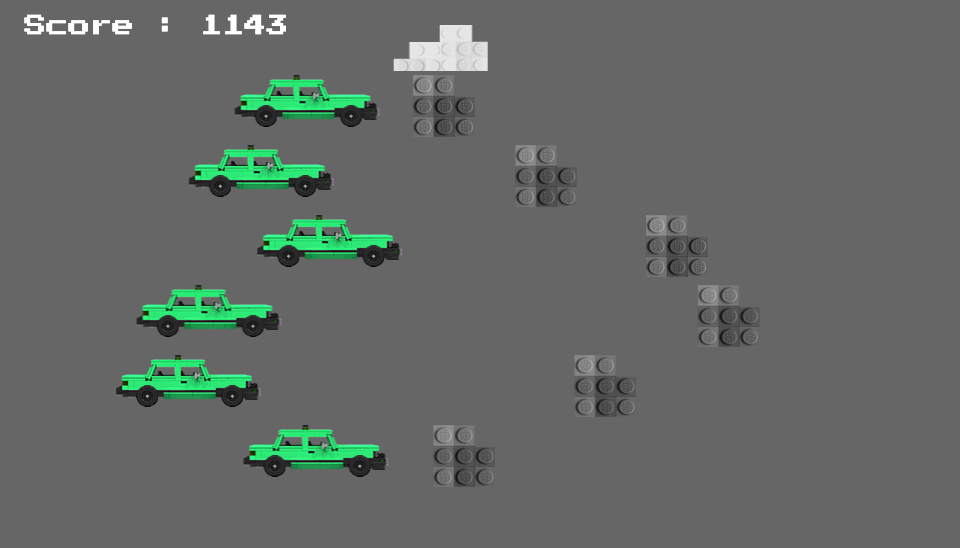
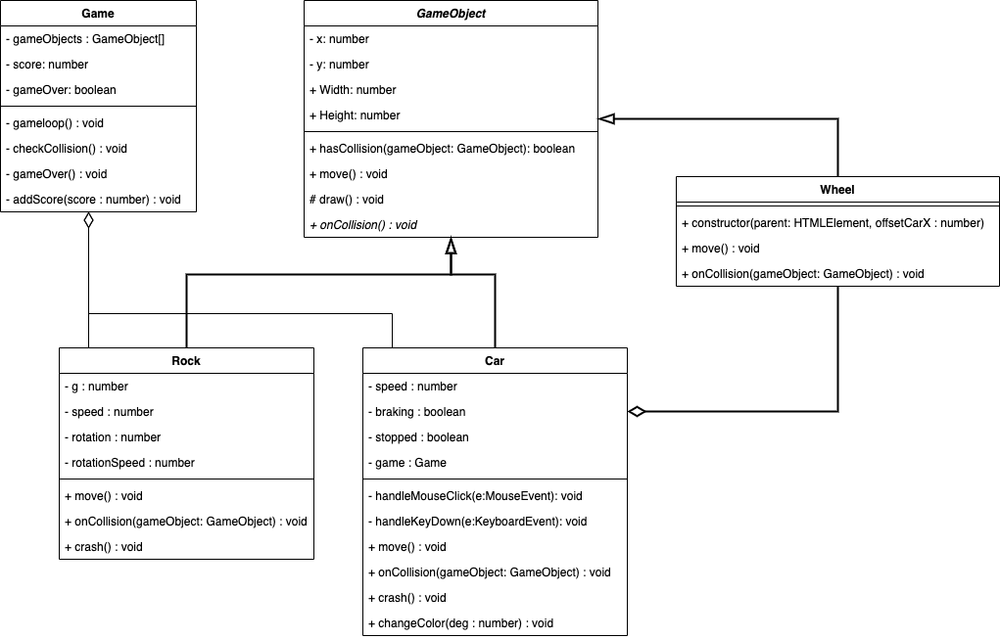

# PRG08 Week 2 Polymorphism

## Close Call


### Gameplay

- <a href="https://hr-cmgt.github.io/PRG08-close-call-completed/" target="_blank">Close call voorbeeld</a>
- De taxi's komt aanrijden van links naar rechts over het plateau. De snelheid is random.
- Zodra je op de spatie drukt begint de auto met afremmen. 
- Als de auto het rotsblok raakt, stort het rotsblok omlaag. Je bent game over.
- Als je voor het rotsblok tot stilstand komt dan is je score hoger naar mate je dichter bij het blok tot stilstand bent gekomen.

### UML


Hierboven zie je de UML van de uiteindelijke uitwerking. Je ziet dat een *abstract* class GameObject (schuingedrukt) is toegevoegd. In deze class is een abstract functie onCollision toegevoegd. We dwingen af dat de child deze functie moet hebben EN invulling moet geven aan de functie. 

Bij een normale class zou er een  lege functie (onCollision) aangemaakt kunnen worden. Maar de kans bestaat dat de child geen invulling geeft en dan gebeurt er niks. Ook helpt je IDE niet met het aanmaken van de method in de child class

### Opdracht
- Bouw de game volgens de hierboven getoonde UML. 
- Zet de game online (github pages) en lever de link in op Teams.

### Tips

#### Polymorphism

Door polymorfisme is het mogelijk om het datatype van een child class te hernoemen naar die van zijn parent. Dit kan toegepast worden in een collectie (met de parent als datatype). Vervolgens kan elke type child toegevoegd worden aan de collectie. 

```
let vehicles : Vehicle[] = []

    vehicles.add(new Car())
    vehicles.add(new Truck())
```

Deze collectie is te doorlopen met een loop, waarna elk object uniform aan te spreken is. Voorwaarde is dat de parent de betreffende functie bevat. Door *overriding* wordt de functionaliteit van de child uitgevoerd.

```
for(let vehicle of vehicles) {
    vehicle.drive()
}
```

#### Type Guard

Wil je van een object weten (die hernoemt is naar zijn parent) wat zijn oorspronkelijke datatype is (toen deze werd aangemaakt)? Dan kun je gebruik maken van een *Type Guard*. 
In de bovenstaande code kan je dat bijvoorbeeld in de loop doen.
```
for(let vehicle of vehicles) {
    if(vehicle instanceof Car) {
        // Dit is een auto
        vehicle.brake() // Dit kan alleen een auto, een Truck kan dit niet.
    }
}
```

#### Hoe het spel is opgezet
- De html heeft een `<container>` element waarin alle game elementen geplaatst worden.
- Met CSS plaats je de container in het midden van het scherm.
- Maak eerst de gameobject class.
- De game loop roept de move functie van de auto en de rots aan. 
- Als je aan car een verwijzing naar game meegeeft, dan kan car ook functies van game aanroepen, zoals game over.
- De speed van de auto bepaalt hoe veel de auto verplaatst per loop.
- De rots heeft een snelheid van 0, maar die wordt verhoogd als de auto de rots raakt.
- Als de car zijn eigen speed vermenigvuldigt met 0.9 bereik je een "afremmend" effect: `this.speed *= 0.9`.
- De auto heeft twee Wheels. Als je de `<wheel>` elementen in het `<car>` element plaatst, in plaats van in `<container>`, dan bewegen ze vanzelf mee met de car.
```
<body>
  <container>
    <car>
      <wheel></wheel>
      <wheel></wheel>
    </car>
  </container>
</body>
```

#### Keyboard Input
```
constructor(){
   window.addEventListener("keydown", (e:KeyboardEvent) => this.onKeyDown(e));
}
private onKeyDown(event:KeyboardEvent):void {
   console.log(event.keyCode);
}       
```

## Lezen
- [Game Loop, Collision detection, Keyboard input](https://github.com/HR-CMGT/PRG04-Week3-examples)
- [Inheritance in Typescript](https://www.typescriptlang.org/docs/handbook/classes.html)
- [Interface in Typescript](https://www.typescriptlang.org/docs/handbook/interfaces.html)
- [Typescript Getting Started](https://basarat.gitbooks.io/typescript/content/docs/getting-started.html)
- [Arrow functions](https://developer.mozilla.org/en/docs/Web/JavaScript/Reference/Functions/Arrow_functions)
- [ES6 For In loops](https://developer.mozilla.org/en-US/docs/Web/JavaScript/Reference/Statements/for...in)
- [ES6 For Of loops](https://developer.mozilla.org/en/docs/Web/JavaScript/Reference/Statements/for...of)
- [Class Code Naming Conventions](https://dev.to/mohitrajput987/coding-best-practices-part-1-naming-conventions--class-designing-principles)
